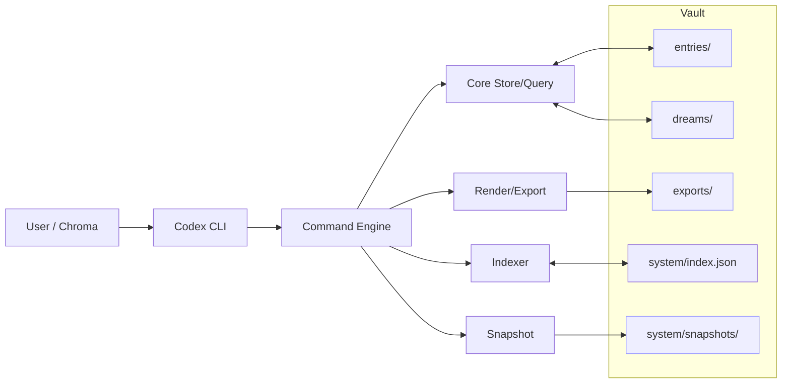



# VesselOS – Codex Architecture

This page maps the core layers and data flows of VesselOS (Codex CLI + core).

## High-Level Map

```
User / Chroma ─▶ CLI (codex) ─▶ Command Engine ─▶ Core (store/query/render)
                                    │                   │
                                    │                   ├─ Indexer (system/index.json)
                                    │                   ├─ Export (md/txt/json/yaml)
                                    │                   └─ Snapshot (system/snapshots/*)
                                    │
                                    └─ Wizards (export wizard)

Filesystem (vault)
  • entries/      JSON entries (logs, fragments)
  • dreams/       Dream-origin entries
  • exports/      Rendered artifacts (md/txt/json/yaml, etc.)
  • system/
      ├─ index.json  (lightweight index)
      └─ snapshots/  (timestamped copies)
```

## CLI Surfaces

```
codex init     – scaffold vault
codex add      – create entry (optionally dream)
codex list     – list by tag/date/type
codex summon   – retrieve (key/filters; md/txt/json/yaml)
codex echo     – resonance search (phrase/tag/tone; fuzzy)
codex grep     – regex/phrase search; --json --fields
codex update   – surgical regex replacement
codex export   – bundles + single-entry exports
codex snapshot – snapshots; --all/--tag/--date/--type; --zip
```

## Component Diagram (Mermaid)



